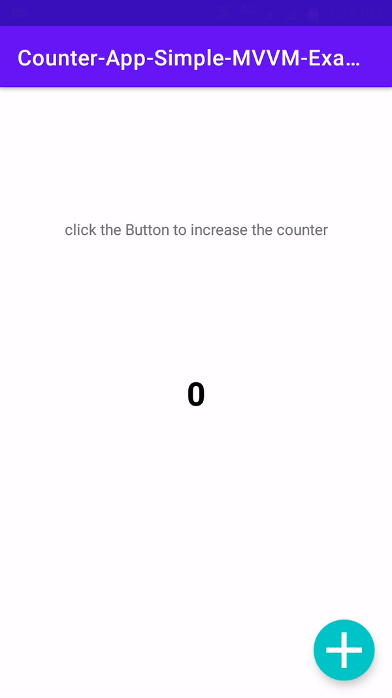

# Counter-App-Simple-MVVM-Example
A simple Counter App to demonstrate **MVVM** in android  
  
  
  
  
## Model-View-ViewModel 

**Latest Upadte**  
Added **MeltDown** Functionality that survives activty lifecycle changes and orientation changes.  

  
  
  
  

